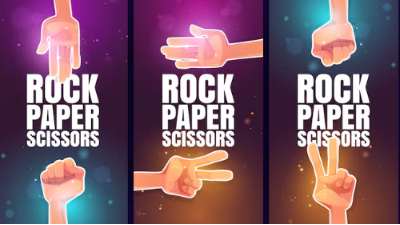

# Personal Portfolio Website

A responsive and modern personal portfolio showcasing my background, skills, and projects.  
Built with **HTML, CSS**, this portfolio highlights both **Coding Skills** and **Professional Skills** using progress bars for clear visualization.

---
## 🚀 Features
- **Responsive Design**: Works seamlessly across desktop, tablet, and mobile.
- **Navigation Bar**: Fixed header with smooth scrolling to sections.
- **About Me Section**: Introduction with career goals and social links.
- **Skills Section**:
  - Coding Skills (HTML, CSS, JavaScript, Python)
  - Professional Skills (Web Design, Web Development, Graphic Design, SEO Marketing)
  - Progress bars to visually represent proficiency levels.
- **Services Section**: Cards describing offered services.
- **Portfolio Section**: Placeholder for projects.
- **Contact Section**: Links to social media and CV download.

---

## 🛠️ Technologies Used
- **HTML5** for structure
- **CSS3** for styling and responsiveness
- **Flexbox & Media Queries** for layout
- **Devicon** for skill icons
---

## 📂 Project Structure

portfolio/
│── index.html        # Main HTML file
│── style.css         # Stylesheet
│── TSARKAN.png       # Profile image
│── Rock_Paper_Scissor.png
│── Library.png
│── Admin_Dashboard.png
│── Gpa_Calculator.png
---

## 🖼️ Image Functionality

Project images in the **Portfolio Section** are now interactive:  
- 🔗 **Clickable Images** – Each project screenshot redirects to its **deployed live demo site**.  
- 🖱️ **User Experience** – When a visitor clicks/touches an image, they are taken directly to the live deployed project.  
- 🎨 **Hover Effects (CSS)** – Images include hover animations (e.g., scale, shadow) to indicate they are clickable.  

### Example (HTML)

# 🚀 Sections Overview

### 🏠 Home  
Introduction and navigation bar  

### 👤 About Me  
Professional background and career goals  

### 🧑‍💻 Services  
Web development, data science, and software engineering offerings  

### 📊 Skills  
Coding and professional skills with progress visualization  

### 💼 Portfolio  
Latest projects with screenshots  

### 📬 Contact  
Phone, email, GitHub, and social media links  

---

# 🧑‍💻 Services

### 🌐 Web Development  
End‑to‑end applications with **React, Tailwind CSS, Node.js, and Python**.  

### 📊 Data Science  
Predictive models and actionable insights, especially in **agriculture**.  

### 🛠️ Software Development  
Building resilient systems with **clean documentation** and a **growth mindset**.  

---

# 📊 Skills

### 💻 Coding Skills
- **HTML** – 90%  
- **CSS** – 80%  
- **JavaScript** – 65%  
- **Python** – 75%  

### 🎯 Professional Skills
- **Web Design** – 95%  
- **Web Development** – 80%  
- **Communication** – 85%  
- **Problem Solving** – 90%  

---

# 📸 Latest Projects
- 🪨 **Rock Paper Scissor Game**  
- 📚 **Library Management System**  
- 🖥️ **Admin Dashboard**  
- 🎓 **GPA Calculator**  

---

# 📬 Contact

- 📞 **Phone:** [+251929748439](tel:+251929748439)  
- 📧 **Email:** tsarkandesalegn582@gmail.com  
- 🐦 **Twitter:** [@DesalegnTs70930](https://x.com/DesalegnTs70930)  
- 💻 **GitHub:** [Tsarkan-Desalegn](https://github.com/Tsarkan-Desalegn)  
- 💼 **LinkedIn:** *(link placeholder)*  
- 📘 **Facebook:** *(link placeholder)*  
